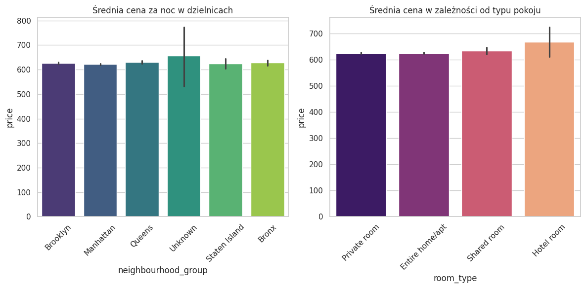
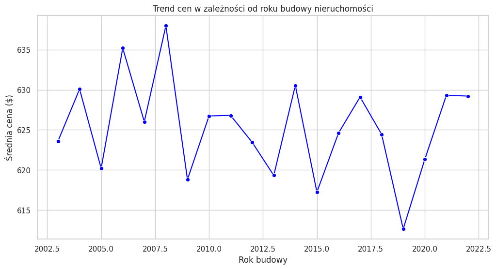
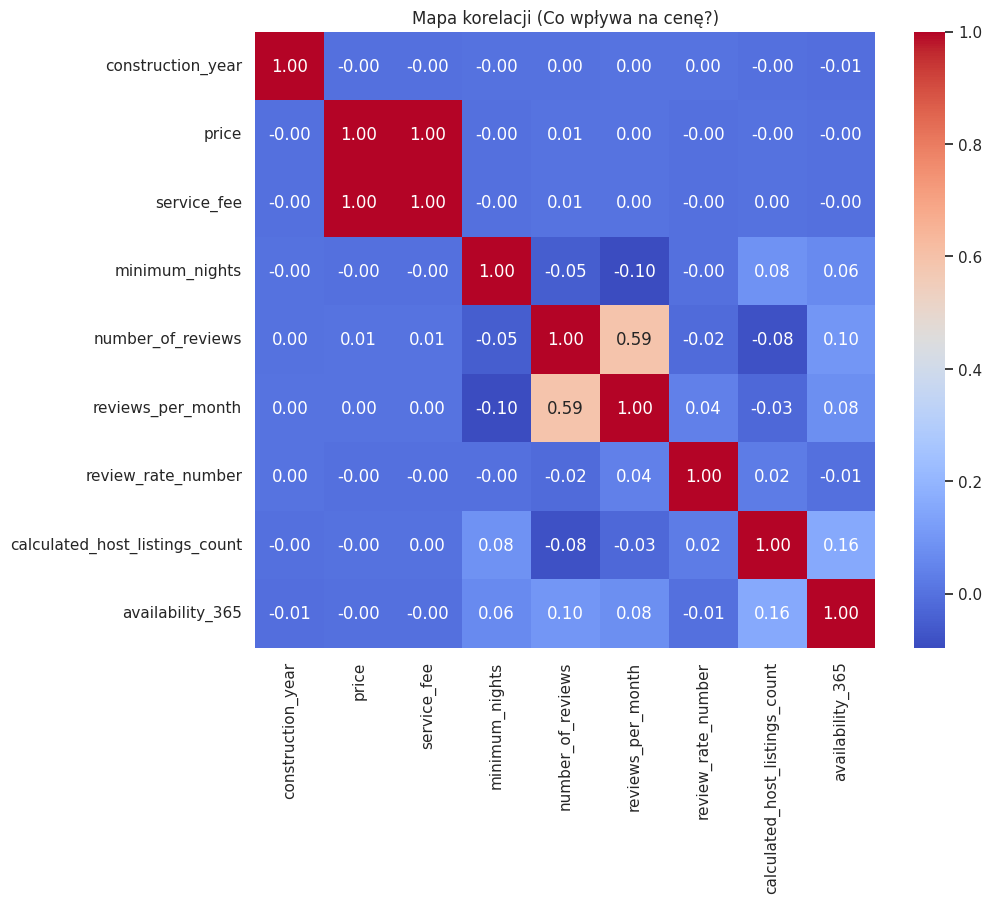
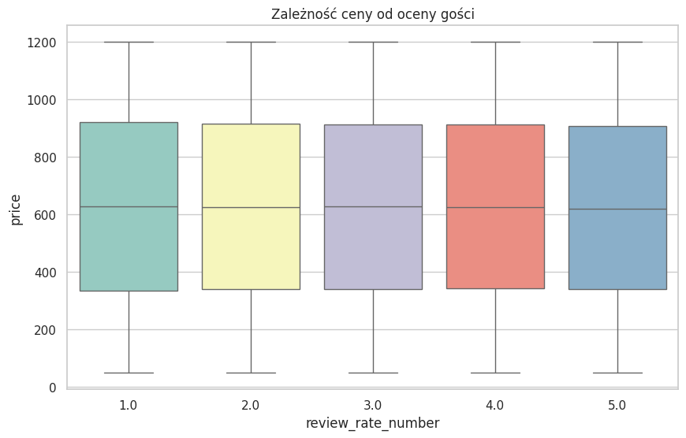

# 📈 RAPORT: Strategia Inwestycyjna AirBNB (Rynek Nowy Jork)
[cite_start]**Autor:** Andrzej Skrucha [cite: 26]
[cite_start]**Narzędzia:** Python (Pandas, Matplotlib, Seaborn), Tableau [cite: 27]

---

## 1. Wstęp i Metodologia
[cite_start]Celem raportu jest wskazanie optymalnych kierunków inwestycyjnych na rynku nieruchomości w Nowym Jorku pod kątem najmu krótkoterminowego[cite: 29]. [cite_start]Analiza została przeprowadzona na zbiorze danych obejmującym ponad **100 000 ofert**[cite: 30].

[cite_start]**Kluczowe kroki analityczne:** [cite: 31]
* [cite_start]**Czyszczenie danych:** Usunięcie duplikatów i profesjonalna obsługa brakujących wartości w cenach[cite: 32].
* [cite_start]**Segmentacja:** Analiza ofert ze względu na dzielnice (Boroughs) oraz typ pokoju[cite: 33].
* [cite_start]**Analiza korelacji:** Badanie zależności między ceną, rokiem budowy a ocenami gości[cite: 34, 35].

---

## 2. Analiza Wizualna i Statystyczna

### A. Średnie ceny w dzielnicach i typy pokoi
[cite_start]Analiza rozkładu cen pozwala zrozumieć, które segmenty rynku są najbardziej dochodowe[cite: 33].
 
[cite_start]*Wnioski: Segment "Hotel room" generuje najwyższe ceny, jednak dla inwestorów indywidualnych kluczowy pozostaje segment "Entire home/apt"[cite: 33].*

### B. Trend cenowy w czasie
[cite_start]Badanie wpływu roku budowy nieruchomości na aktualne stawki rynkowe[cite: 34].

[cite_start]*Wnioski: Ceny wykazują fluktuacje, ale nie są bezpośrednio skorelowane wyłącznie z najnowszym budownictwem[cite: 34].*

### C. Mapa Korelacji (Co wpływa na cenę?)
[cite_start]Techniczna macierz korelacji odkrywająca powiązania między zmiennymi rynkowymi[cite: 34].

[cite_start]*Wnioski: Odnotowano bardzo silną zależność między ceną a opłatą serwisową (service fee)[cite: 34].*

### D. Satysfakcja gości vs Cena
[cite_start]Analiza rozkładu cen w relacji do ocen wystawianych przez użytkowników[cite: 35].

[cite_start]*Wnioski: Mediana cen pozostaje stabilna na różnych poziomach ocen, co sugeruje, że wysoka jakość nie zawsze musi wiązać się z najwyższą ceną na rynku[cite: 35].*

---

## 3. Statystyczne Zestawienie Dzielnic

| Dzielnice | Cena średnia | Mediana | Liczba ofert | Gwiazdki (średnia) |
| :--- | :---: | :---: | :---: | :---: |
| **Bronx** | $627.76 | $630.5 | 2 712 | 3.33 |
| **Brooklyn** | $626.56 | $625.0 | 41 843 | 3.26 |
| **Manhattan** | $622.44 | $623.0 | 43 793 | 3.28 |
| **Queens** | $630.19 | $626.0 | 13 267 | 3.33 |
| **Staten Island** | $624.49 | $628.0 | 955 | 3.41 |
| **Unknown** | $657.17 | $651.0 | 29 | 3.22 |
[cite_start][cite: 36]

---

## [cite_start]4. Rekomendowane Strategie Inwestycyjne [cite: 37]

### [cite_start]🚀 Scenariusz A: Kapitał do 1 mln USD [cite: 38]
* [cite_start]**Rekomendacja:** **Brooklyn** (szczególnie Bedford-Stuyvesant i Bushwick)[cite: 39].
* [cite_start]**Typ nieruchomości:** Całe mieszkanie lub 2x Private Room[cite: 40].
* [cite_start]**Uzasadnienie:** Najlepszy stosunek ceny zakupu do przychodu z nocy ($620-650), co gwarantuje szybszy zwrot z kapitału (ROI)[cite: 41, 42].

### [cite_start]💎 Scenariusz B: Kapitał powyżej 1 mln USD [cite: 43]
* [cite_start]**Rekomendacja:** **Manhattan**[cite: 44].
* [cite_start]**Typ nieruchomości:** Luxury Entire Home/Apt (Midtown, Upper West Side)[cite: 45].
* [cite_start]**Uzasadnienie:** Najwyższy popyt całoroczny (Availability) oraz prestiż pozwalający na utrzymanie wysokich cen[cite: 46].

---

## [cite_start]5. Podsumowanie - Gdzie inwestować? [cite: 47]

| Ocena | Dzielnica | Uzasadnienie |
| :--- | :--- | :--- |
| **TOP 1** | Manhattan | Prestiż, najwyższe ceny dobowe, stały dopływ turystów. |
| **Wschodząca Gwiazda** | Queens | Najszybszy wzrost liczby recenzji, idealne dla mniejszych budżetów. |
| **Omijać** | Staten Island | Najniższy popyt i ograniczona komunikacja z resztą miasta. |
[cite_start][cite: 48]

---
👉 **[ZOBACZ INTERAKTYWNY DASHBOARD W TABLEAU](https://public.tableau.com/app/profile/andrzej.skrucha/viz/StoryAS_AirBnB_analiza/Story1?publish=yes)**
